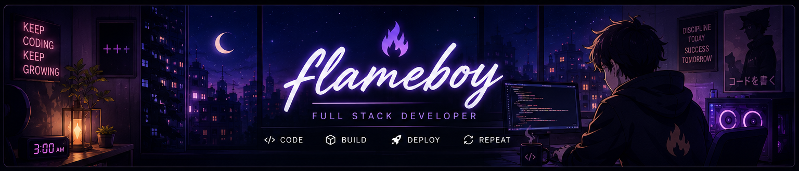
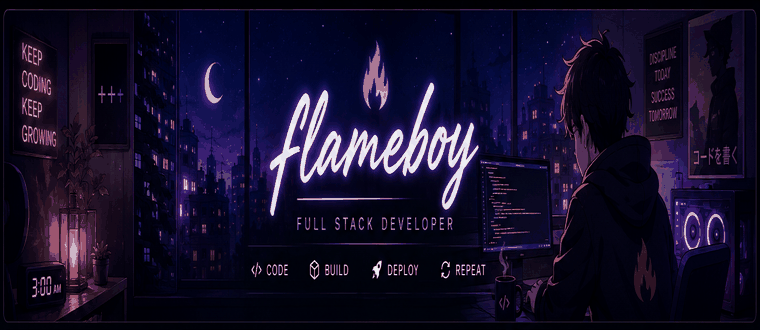

<div align="center">

<!-- 🌌 COZY FLAMEBOY BANNER -->


<br><br>

<!-- ✨ TYPING EFFECT -->


<br><br>

<a href="https://flameiro.vercel.app/">

</a>
<a href="https://github.com/flameboy-dev">

</a>
<a href="https://linkedin.com/in/shubhajit-giri">

</a>
<a href="mailto:girishubhajit37@gmail.com">

</a>

</div>

---

## 🌙 About Me



Hey! I'm **flameboy** 👋

I'm a **Full-Stack Developer** who enjoys turning ideas into real-world web applications and learning by building.

```js
const flameboy = {
  role: "Full-Stack Developer",
  stack: "MERN",
  currentlyLearning: ["TypeScript", "Next.js"],
  currentlyBuilding: "Syncora",
  openTo: "Open Source & Developer Opportunities",
  loves: ["Anime", "Coding", "Building Projects"]
};
```

- 🔭 Building **Syncora**
- 🌱 Learning **TypeScript & Next.js**
- 💻 Focused on **MERN Stack & Backend Development**
- 👯 Open to **Open Source Collaboration**
- 🎯 Goal: Become a stronger **Full-Stack Developer**
- 🎌 Anime enthusiast

<br clear="right"/>

---

# ⚡ Current Mission

<div align="center">

### 🚀 SYNCORA

**A full-stack team collaboration platform**

📋 Project Management &nbsp; • &nbsp;
💬 Team Communication &nbsp; • &nbsp;
⚡ Productivity &nbsp; • &nbsp;
👥 Collaboration

<br>


<br><br>

`🟡 Under Active Development`

</div>

---

# 🛠️ Tech Arsenal

<div align="center">

### 🎨 Frontend


<br><br>

### ⚙️ Backend & Database


<br><br>

### 🔧 Tools & Environment


</div>

---

# 🚀 Featured Projects

### ⚡ Syncora
**Team Collaboration & Productivity Platform**

A full-stack platform designed to bring project management, communication and productivity into one place.

`React` `Node.js` `Express` `MongoDB` `TypeScript`

🚧 **Currently Building**

### 🏫 Evergreen Model School
**School Website**

A complete school website built to provide students, parents and visitors with information about academics, facilities, activities and the school environment.

🌐 [**Visit Website →**](https://evergreenmodelschool.in/)

### 🏨 Book My Hotel
**Hotel Booking Web Application**

A web application focused on discovering hotels and providing a simple booking experience.

🌐 [**Live Demo →**](https://book-my-hotel-eight.vercel.app/)

### 🩸 Blood Care
**Blood Bank Management System**

A web application designed around donor management, blood requests and blood availability.

🌐 [**Live Demo →**](https://blood-care-alpha.vercel.app/)

---

# 🎨 Development Philosophy

<div align="center">

> ### **Code. Build. Break. Learn. Repeat.**

💡 **Ideas** → 💻 **Code** → 🚀 **Deploy** → 📚 **Learn** → 🔁 **Improve**

</div>

---

# 📊 GitHub Stats

<div align="center">


<br><br>


</div>

---

# 📈 Contribution Graph

<div align="center">


</div>

---

# 🎌 Anime Corner

<div align="center">


<br><br>

### ☕ Late nights. 💻 Clean code. 🎌 Good anime.

</div>

---

# 🤝 Let's Connect

<div align="center">

<a href="https://github.com/flameboy-dev"></a>
&nbsp;&nbsp;&nbsp;
<a href="https://linkedin.com/in/shubhajit-giri"></a>
&nbsp;&nbsp;&nbsp;
<a href="mailto:girishubhajit37@gmail.com"></a>
&nbsp;&nbsp;&nbsp;
<a href="https://youtube.com/@iamflameiro"></a>

<br><br>

🌐 **Portfolio:** [flameiro.vercel.app](https://flameiro.vercel.app/)

📄 **Resume:** [View My Resume](https://drive.google.com/file/d/17FEQ7QZtxXM32q05pUAHPmJOzpG8643q/view)

📧 **Email:** girishubhajit37@gmail.com

</div>

---

<div align="center">

### 💜 Thanks for visiting my profile

*Made with ☕, code & a little bit of anime.*

<br>


</div>
